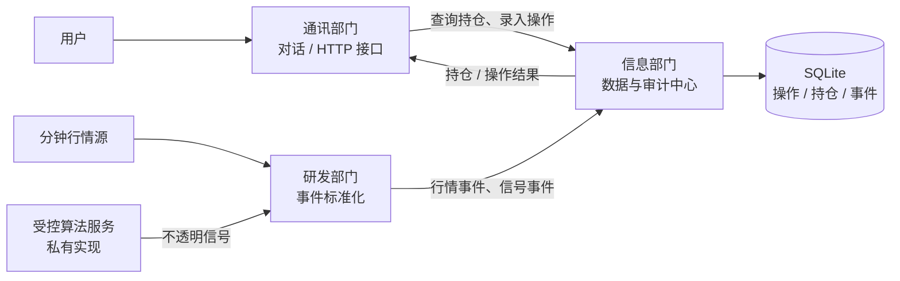

# QuantOps Collaboration Platform

> 面向个人交易工作流的服务协同与数据治理平台。将 **通讯交互、行情/用户数据、研发执行与受控算法服务** 解耦为清晰的部门边界，让每一条业务动作都可被传递、落库和追溯。


## 项目定位

这是一个以“部门协作”为核心的个人交易系统架构实践。系统并不将机器人、数据存储或研发任务混在同一个脚本中，而是围绕稳定的数据流建立边界：

- **通讯部门**：承接用户查询与手工操作，并返回可读结果；
- **信息部门**：负责行情、用户操作、持仓快照与审计事件的统一存储；
- **研发部门**：将外部数据与算法服务的输出转换为标准化事件；
- **算法部门**：作为独立、受控的信号生产者，只输出信号，不直接接触用户数据与通讯入口。

公开仓库保留了完整的协作层参考实现，可直接运行和阅读；真正的策略逻辑、参数、指标、历史数据及回测资产均隔离在私有环境中。

## 架构一览



关键设计是将“**信号如何产生**”与“**信号如何被安全地传递和记录**”分离。公开代码只处理后者：信号以不透明 JSON 信封进入系统，协作层不会解析、推导或重写其业务含义。

## 核心能力

| 能力 | 实现方式 | 价值 |
| --- | --- | --- |
| 部门解耦 | 明确的 HTTP 接口、Pydantic 数据契约与模块边界 | 降低跨模块耦合，便于替换内部实现 |
| 用户持仓查询 | 通讯接口读取信息部门的持仓投影 | 机器人/前端无需直连数据库 |
| 手工操作闭环 | 单个数据库事务同时写入操作记录和持仓快照 | 防止记录成功但持仓未同步 |
| 行情事件归档 | 研发入口接收并持久化分钟级事件 | 让数据链路具备最小审计能力 |
| 信号安全传递 | 仅接受、校验并存储不透明信号信封 | 对外展示协作能力，不暴露策略资产 |
| 本地可运行 | FastAPI + SQLite，无外部基础设施依赖 | 便于演示、面试讲解与二次扩展 |

## 典型业务闭环

```text
用户发起“查询持仓”
    -> 通讯部门调用信息部门
    -> 信息部门读取持仓投影
    -> 通讯部门组织结果并返回

用户提交一笔手工操作
    -> 通讯部门完成输入校验
    -> 信息部门在同一事务中写入操作记录与最新持仓
    -> 通讯部门返回更新后的持仓

研发部门收到行情 / 私有算法服务输出
    -> 标准化为分钟行情事件或不透明信号
    -> 信息部门持久化，用于后续审计与消费
```

## 公开参考实现

[`public_reference/`](public_reference/) 是从零编写、可运行的脱敏协作模块：

```text
public_reference/
├── communication/       # 通讯部门：HTTP 边界、用户请求转发
├── information/         # 信息部门：SQLite 仓储与事务写入
├── research/            # 研发部门：受控算法输出的接入网关
├── contracts.py         # 跨部门数据契约
└── README.md            # 接口与调用流程
```

接口文档启动后可在 `/docs` 查看：

| 接口 | 调用方 | 职责 |
| --- | --- | --- |
| `POST /internal/minute-bars` | 研发部门 | 写入标准化分钟行情事件 |
| `POST /internal/signals` | 研发部门 | 接收并存储不透明信号 |
| `GET /users/{user_id}/positions` | 通讯部门 | 查询用户持仓 |
| `POST /users/{user_id}/operations` | 通讯部门 | 录入手工操作并原子更新持仓 |

## 快速开始

```powershell
git clone https://github.com/chengjh0521-lgtm/qq-dialog-bot-ops-sanitized.git
cd qq-dialog-bot-ops-sanitized
python -m venv .venv
.\.venv\Scripts\Activate.ps1
pip install -r requirements.txt
uvicorn public_reference.communication.api:app --reload
```

随后访问 [http://127.0.0.1:8000/docs](http://127.0.0.1:8000/docs)。示例数据仅写入本机 `runtime/operations.db`，已被 Git 忽略。

## 技术栈

`Python` · `FastAPI` · `Pydantic` · `SQLite` · `HTTP API` · `事务一致性` · `事件化数据流` · `模块化服务编排`

## 安全与开源边界

本仓库是用于展示系统工程能力的**公开协作层**，不是生产策略仓库。以下内容被严格排除：

- 所有策略、算法、指标、参数、仓位计算与信号产生规则；
- 历史行情、真实用户数据、持仓台账、数据库、日志与运行缓存；
- Token、密钥、授权信息与任何 `.env` 内容；
- 可反推内部策略的回测代码、策略服务实现或研发文档。

完整排除规则见 [SECURITY_SCOPE.md](SECURITY_SCOPE.md)。
